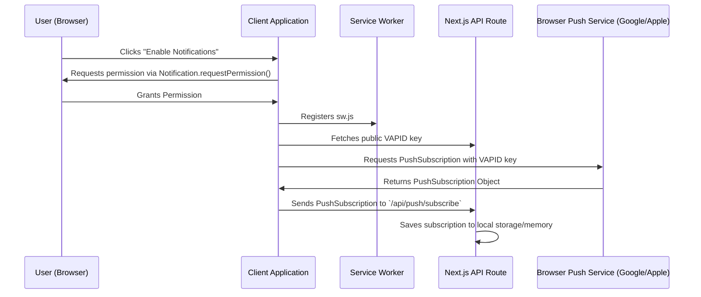
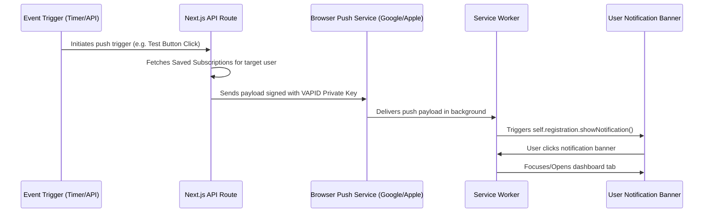

# Technical Specification: Web Push Notifications

## 1. Executive Summary
This document outlines the design and integration of a **Web Push Notification** system into the Next.js application. The goal is to allow users to receive real-time reminders and system alerts even when the application is not actively open in their browser tabs. 

To satisfy the constraint of **not changing the existing main application structure**, this feature will be integrated as a modular plugin/utility layer. It will utilize a service worker registered in the background, a new local Next.js API route for push subscription management, and a clean settings UI toggle that requests browser permissions.

---

## 2. Requirements

### Functional Requirements
1. **Permission Request**: Users can grant or deny browser notification permissions through a simple UI switch in the Settings page.
2. **Subscription Management**: The client browser registers a Service Worker and creates a Push Subscription using VAPID keys.
3. **Local/Server Storage**: Subscriptions are sent to the Next.js backend and stored in a simple, local file-based database (or in-memory map for development) so that notifications can target the active user session.
4. **Push Triggers**: The system can trigger push notifications for:
   - Task due reminders.
   - Collaborator/Team action notifications.
   - Manual test push notifications (for developer validation).
5. **Background Delivery**: Push notifications must appear even when the browser tab is closed.
6. **Action Handling**: Clicking a notification opens/focuses the app and navigates to the relevant task/dashboard view.

### Non-Functional Requirements
- **No Structural Disruption**: The integration must not modify existing database schemas or core task lists logic.
- **Secure Authentication**: Use standard VAPID (Voluntary Application Server Identification) headers to verify server push authenticity.
- **Performance**: Service worker registration must run asynchronously and not block the main document rendering thread (LCP/INP optimized).

---

## 3. Architecture & Tech Stack

### Technology Components
1. **Web Push Protocol**: Standard browser Web Push API supported by Google Chrome, Apple Safari, Mozilla Firefox, and Microsoft Edge.
2. **Web-Push Library (`web-push`)**: An npm package on the Next.js backend to encrypt payloads and send push notifications via Google Cloud Messaging / Apple Push Notification service.
3. **Service Worker (`public/sw.js`)**: A background script running in the browser to handle `push` and `notificationclick` events.
4. **Next.js Route Handlers**:
   - `GET /api/push/vapid-public-key`: Returns the public VAPID key.
   - `POST /api/push/subscribe`: Registers a new subscription.
   - `POST /api/push/send-test`: Sends a manual test push notification to a subscription.

### File Layout [NEW & MODIFY]
```
src/
├── app/
│   ├── api/
│   │   └── push/
│   │       ├── vapid-public-key/
│   │       │   └── route.ts         [NEW] - API to serve VAPID public key
│   │       ├── subscribe/
│   │       │   └── route.ts         [NEW] - API to save push subscription details
│   │       └── send-test/
│   │           └── route.ts         [NEW] - API to trigger test push messages
│   └── dashboard/
│       └── settings/
│           └── page.tsx             [MODIFY] - Add push toggle & test button
├── components/
│   └── providers/
│       └── PushNotificationProvider.tsx [NEW] - Context provider to manage permission status, registration, and SW binding
public/
└── sw.js                            [NEW] - Service Worker script for listening to background push events
```

---

## 4. State & Data Flow

### 1. Subscription Flow


### 2. Push Notification Dispatch Flow


---

## 5. Implementation Strategy
1. **Dependencies**: Install the standard `web-push` npm module.
2. **VAPID Key Generation**: Add a script or environment setup to generate static VAPID keys for development/production.
3. **Local Subscription Storage**: For local-first mode, subscriptions will be saved in a simple local file (`src/lib/pushSubscriptions.json`) to persist across dev server restarts, avoiding Supabase configuration dependency.
4. **UI Integration**: Embed a modular toggle inside `src/app/dashboard/settings/page.tsx` that links to the push notification context.
